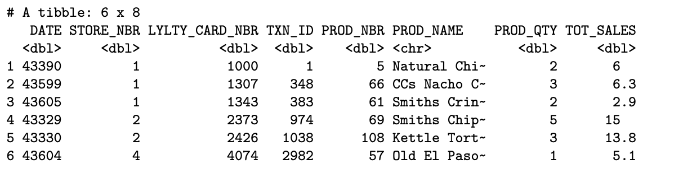
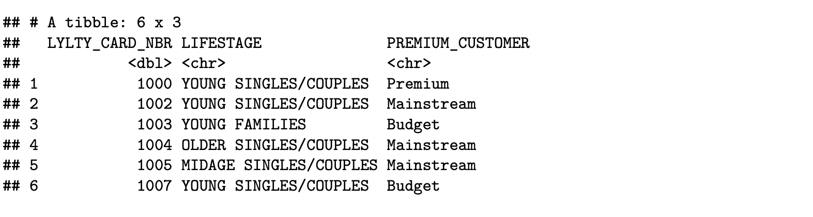
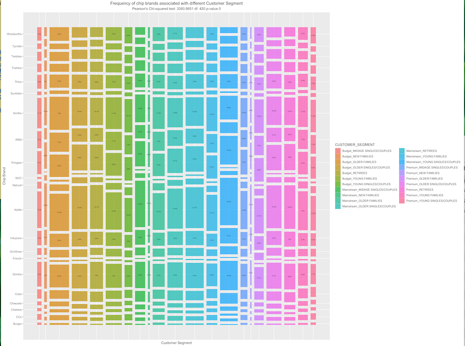
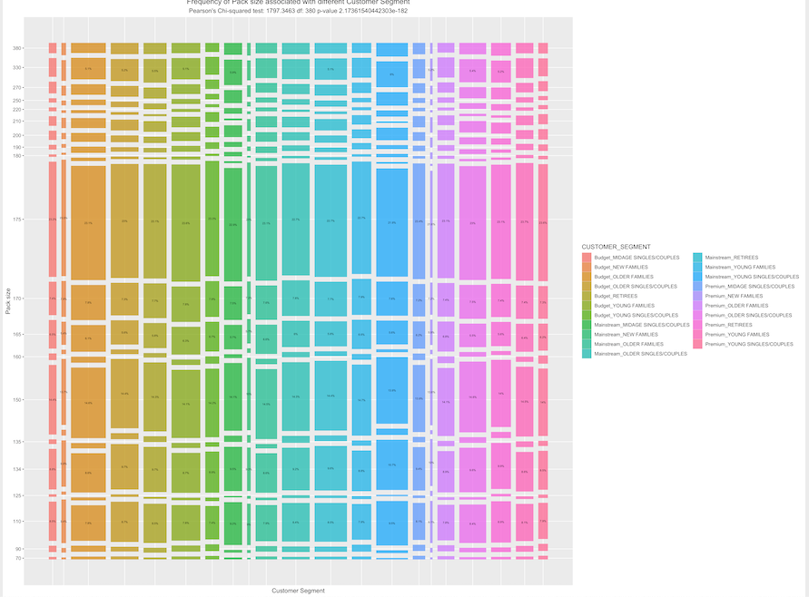

# Commercial Insights from Transaction and Customer Data: Project Overview

*   264,836 transactions of all chips purchased over one year and Customer data of 72,637 members were checked for missing data and nulls. 
*   Engineered features from the text of product names to extract brand names and pack size to each transaction.
*   Joined two dataframes to examine customer segments and their purchase patterns. 
*   Performed t-test and Chi-squared test to test the association between customer segments and their purchase behaviors. 
*   Visualised purchase behaviors with mosaic plots. 

## The following recommendations were suggested for Chip Category Manager based on the data:

*   Brands to stock up
*   Pack sizes to stock up
*   Promotion strategy to optimise different customer spending behaviours 

## Code and Resources Used

* **Rstudio Version:** 1.3.1073
* **Data source:** https://www.theforage.com/virtual-internships/prototype/NkaC7knWtjSbi6aYv/Data-Analytics
* **Mosaics plots:** https://www.kaggle.com/dhafer/mosaics-plots-using-ggmosaic
* **Markdown cheatsheet:** https://github.com/adam-p/markdown-here/wiki/Markdown-Here-Cheatsheet#images

## Datasource overview

Two files were used: transactiondata and purchasedata. 

**Transactiondata**

**Purchasedata**

## Brand name and Customer Segment 

21 Brand names were extracted and made unnique from 114 distinct Product descriptions. 21 Customer Segments were formed based on 3 Lifestages and 7 Premium groups. Association between Brand names and Customer Segments were tested with Pearson Chi-squared test. 

**Brand names and Customer Segments Association**

## Pack size and Customer Segment

20 distinct pack sizes were extracted from Product descriptions. Association between Pack sizes and Customer Segments were tested with Pearson Chi-squared test.

**Pack Sizes and Customer Segments Association**
